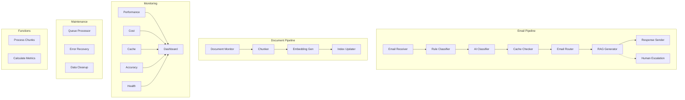

# Complete Recipe Architecture for Workato RAG Email Response System

## Recipe Overview Summary
**Total Recipes:** 21 (5 Email Triage, 4 Document Processing, 2 Response Generation, 5 Monitoring, 3 Maintenance, 2 Callable Functions)

---

## LAYER 1: EMAIL TRIAGE (Handles 750 emails/day)

### Recipe 1: Email Receiver and Batcher
**Purpose:** Collect incoming emails and batch for efficient processing

```yaml
Trigger: 
  Type: Scheduled (every 2 minutes)
  Alternative: Gmail real-time webhook
  
Actions:
  1. Gmail: Search for new emails
     - Query: "is:unread after:{last_run_time}"
     - Max results: 50 per batch
     
  2. For each email:
     - Extract: message_id, thread_id, sender, subject, body
     - Insert into email_processing_queue
     - Status: 'pending'
     - Mark email as read in Gmail
     
  3. RAG_Utils: Clean Email Text (batch)
     - Remove signatures and quotes
     - Extract primary query
     
  4. Update monitoring_dashboard
     - Metric: emails_received_per_batch
     
Error Handling:
  - Duplicate message_id: Skip silently
  - Gmail API error: Retry with exponential backoff
  
Performance: 
  - Process 25-30 emails per minute
  - Batch insert to reduce database calls
```

### Recipe 2: Email Rule-Based Classifier
**Purpose:** Filter 750→150 emails using rules (no AI costs)

```yaml
Trigger:
  Type: New record in email_processing_queue
  Condition: status = 'pending'
  
Actions:
  1. Load active rules from email_classification_rules
     - Cache for 5 minutes
     - Order by priority
     
  2. For each email:
     a. Apply rules sequentially:
        - Check sender patterns (noreply@, newsletter@)
        - Check subject patterns (Order #, Confirmation)
        - Check body patterns (unsubscribe, automated)
     
     b. If match found:
        - Update category: 'auto_archive', 'delete', 'needs_ai'
        - Update rule hit_count
        - If action = 'delete': Move to trash
        - If action = 'archive': Apply Gmail label
     
     c. If no match:
        - Set category: 'needs_ai'
     
  3. Update email_processing_queue
     - Set status: 'classified'
     
  4. Update monitoring_dashboard
     - Metric: rule_classification_rate
     - Track: 650 filtered vs 100 need AI
     
Data Tables Used:
  - email_classification_rules (READ)
  - email_processing_queue (UPDATE)
  
Performance:
  - Process 750 emails in <5 minutes
  - No API costs
```

### Recipe 3: Email AI Classifier
**Purpose:** Use Gemini Flash to classify remaining 150→100 emails

```yaml
Trigger:
  Type: Batch trigger
  Source: email_processing_queue
  Condition: category = 'needs_ai' AND status = 'classified'
  Batch size: 10
  
Actions:
  1. Prepare batch prompt for Gemini Flash:
     - Include 10 email summaries
     - Request: Classify as 'needs_response' or 'informational'
     
  2. Call Vertex AI - Gemini Flash:
     - Model: gemini-1.5-flash
     - Temperature: 0.1 (consistent classification)
     - Max tokens: 500
     - Cost: ~$0.01 per 100 emails
     
  3. Parse AI response:
     - Extract classification for each email
     - Update confidence scores
     
  4. Update email_processing_queue:
     - Set category: 'needs_response' or 'auto_archive'
     - Set status: 'ai_classified'
     
  5. Update monitoring_dashboard:
     - Metric: ai_classification_accuracy
     - Track tokens used
     
Error Handling:
  - AI timeout: Retry individual emails
  - Low confidence: Route to human review
  
Performance:
  - Process 150 emails in 2-3 minutes
  - Cost: <$0.10/day
```

### Recipe 4: Response Cache Checker
**Purpose:** Check if query already has a cached response

```yaml
Trigger:
  Type: Updated record
  Source: email_processing_queue
  Condition: category = 'needs_response' AND status = 'ai_classified'
  
Actions:
  1. RAG_Utils: Clean Email Text
     - Extract normalized query
     
  2. Generate query hash:
     - SHA256 of normalized query
     
  3. Lookup in response_cache:
     - Match by query_hash
     - Check expires_at > NOW()
     
  4. If cache hit:
     a. Increment use_count
     b. Update last_used timestamp
     c. Create response in rag_email_responses
     d. Set cache_hit = true
     e. Skip to Response Sender recipe
     
  5. If cache miss:
     - Set status: 'needs_rag'
     - Continue to RAG pipeline
     
  6. Update monitoring_dashboard:
     - Metric: cache_hit_rate
     - Target: >30%
     
Performance:
  - Sub-second cache lookups
  - Saves ~30% of RAG processing costs
```

### Recipe 5: Email Router
**Purpose:** Route emails to appropriate teams or workflows

```yaml
Trigger:
  Type: Updated record
  Source: email_processing_queue
  Condition: status IN ('ai_classified', 'needs_rag')
  
Actions:
  1. Determine routing based on:
     - Sender domain (VIP customers)
     - Subject keywords (billing, technical, sales)
     - Urgency indicators
     - Previous interaction history
     
  2. Apply routing rules:
     - VIP → Priority queue
     - Technical → Tech support workflow
     - Billing → Finance team
     - General → Standard RAG
     
  3. Update email_processing_queue:
     - Add routing metadata
     - Set priority level
     
  4. Trigger appropriate downstream recipe:
     - High priority → Immediate processing
     - Standard → Queue for batch
     
  5. Send notifications if needed:
     - Slack for urgent items
     - Email for team assignments
     
Data Flow:
  - 50-100 emails routed for RAG daily
  - 10-20 escalated to humans
```

---

## LAYER 2: DOCUMENT PROCESSING

### Recipe 6: Document Monitor
**Purpose:** Detect and process Google Drive document changes

```yaml
Trigger:
  Type: Google Drive - New/Updated File
  Folder: /Customer-Documentation/
  File types: PDF, DOCX, TXT, MD
  
Actions:
  1. Check file properties:
     - Size < 10MB
     - Supported format
     - Not in exclusion list
     
  2. Calculate file hash (SHA256)
  
  3. Check rag_document_registry:
     - If exists and hash unchanged: Skip
     - If new or changed: Continue
     
  4. Create entry in rag_document_registry:
     - Set embedding_status: 'pending'
     - Store source_path, file metadata
     
  5. Create job chain in rag_processing_queue:
     a. Job 1: 'chunk_document'
     b. Job 2: 'generate_embeddings' (depends on Job 1)
     c. Job 3: 'update_index' (depends on Job 2)
     - Set correlation_id to link jobs
     
  6. Copy file to GCS:
     - Path: gs://[project]-rag-documents/raw/
     
Error Handling:
  - Large files: Queue for off-peak processing
  - Unsupported format: Log and notify
  
Frequency:
  - Real-time trigger
  - ~10-20 document changes/day
```

### Recipe 7: Document Chunker
**Purpose:** Split documents into optimal chunks for embedding

```yaml
Trigger:
  Type: New/Updated record
  Source: rag_processing_queue
  Condition: job_type = 'chunk_document' AND status = 'queued'
  
Actions:
  1. Set job status: 'processing'
  
  2. Read document from GCS
  
  3. Extract text based on file type:
     - PDF: Use PDF extractor
     - DOCX: Extract with formatting
     - TXT/MD: Direct read
     
  4. RAG_Utils: Smart Chunk Text
     - chunk_size: 1000 tokens
     - chunk_overlap: 100 tokens
     - preserve_sentences: true
     
  5. For each chunk:
     - Insert into document_chunks table
     - Include chunk_index, token_count
     
  6. Update rag_document_registry:
     - Set chunk_count
     - Update last_processed
     
  7. Update rag_processing_queue:
     - Set status: 'completed'
     - Record chunks created
     - Update next job to 'ready'
     
  8. RAG_Utils: Generate Document Metadata
     - Extract key topics, summary
     
Performance:
  - Process 50-100 pages in 2-3 minutes
  - Average: 10-20 chunks per document
```

### Recipe 8: Embedding Generator
**Purpose:** Generate vector embeddings for document chunks

```yaml
Trigger:
  Type: Scheduled (every 5 minutes)
  Alternative: Job queue trigger
  Source: rag_processing_queue
  Condition: job_type = 'generate_embeddings' AND status = 'ready'
  
Actions:
  1. Load chunks from document_chunks:
     - Where embedding_vector IS NULL
     - Batch size: 25 chunks
     
  2. For each batch:
     a. Prepare text array
     b. Call Vertex AI Embeddings:
        - Model: text-embedding-004
        - Dimension: 768
        
  3. RAG_Utils: Format Embeddings Batch
     - Format for Vertex AI Vector Search
     
  4. Store embeddings:
     - Update document_chunks with vectors
     - Save to GCS for backup
     
  5. Update progress:
     - rag_processing_queue.processed_items
     - Calculate progress_percentage
     
  6. Cost tracking:
     - Log tokens_consumed
     - Update daily budget metrics
     
Error Handling:
  - API rate limit: Exponential backoff
  - Partial batch failure: Retry failed items
  
Performance:
  - 25 embeddings per API call
  - ~$0.50 per 1000 chunks
```

### Recipe 9: Index Updater
**Purpose:** Update Vertex AI Vector Search index

```yaml
Trigger:
  Type: Job completion
  Source: rag_processing_queue
  Condition: job_type = 'generate_embeddings' AND status = 'completed'
  
Actions:
  1. Load completed embeddings from batch
  
  2. RAG_Utils: Format Embeddings Batch
     - Prepare for index update
     
  3. Call Vertex AI Vector Search:
     - Add/update datapoints
     - Include metadata filters
     
  4. Verify index update:
     - Query sample vectors
     - Confirm retrieval working
     
  5. Update rag_document_registry:
     - Set embedding_status: 'indexed'
     - Increment version number
     
  6. Clean up old versions:
     - Remove previous embeddings if exists
     - Archive to cold storage
     
  7. Update rag_processing_queue:
     - Mark job chain complete
     
Schedule:
  - Batch updates every 6 hours
  - Immediate for high-priority docs
```

---

## LAYER 3: RESPONSE GENERATION

### Recipe 10: RAG Response Generator
**Purpose:** Main RAG pipeline - generate responses using context

```yaml
Trigger:
  Type: Updated record
  Source: email_processing_queue
  Condition: status = 'needs_rag'
  
Actions:
  1. Extract query from cleaned email text
  
  2. Generate query embedding:
     - Call Vertex AI text-embedding-004
     
  3. Search Vector Index:
     - Top-K: 10 results
     - Minimum similarity: 0.7
     
  4. RAG_Utils: Calculate Similarity
     - Re-rank results
     - Select top 5 most relevant
     
  5. Retrieve full document chunks:
     - From document_chunks table
     - Include surrounding context
     
  6. RAG_Utils: Build RAG Prompt
     - Template: customer_service
     - Include context documents
     - Add system instructions
     
  7. Call Vertex AI - Gemini Pro:
     - Temperature: 0.3
     - Max tokens: 1000
     - Include safety filters
     
  8. RAG_Utils: Validate LLM Response
     - Check relevance
     - Verify no hallucination
     - Calculate confidence score
     
  9. Store in rag_email_responses:
     - Include all metadata
     - Track tokens used
     
  10. If high confidence (>0.8):
      - Add to response_cache
      - Set appropriate TTL
      
Error Handling:
  - No relevant documents: Escalate to human
  - Low confidence: Flag for review
  
Performance:
  - Average response time: 10-15 seconds
  - Cost: ~$0.02 per response
```

### Recipe 11: Response Sender
**Purpose:** Send validated responses back to customers

```yaml
Trigger:
  Type: New record
  Source: rag_email_responses
  Condition: response_sent = false AND confidence > 0.7
  
Actions:
  1. Retrieve original email details:
     - Thread ID for reply threading
     - Sender email address
     
  2. Format response:
     - Add greeting and signature
     - Include disclaimer if needed
     - Format as HTML/plain text
     
  3. Check business rules:
     - Blacklist check
     - Business hours (optional)
     - Customer preferences
     
  4. Send via Gmail API:
     - Reply to thread
     - Add appropriate labels
     - BCC to monitoring address
     
  5. Update records:
     - rag_email_responses.response_sent = true
     - email_processing_queue.status = 'completed'
     
  6. Log in audit_log:
     - Action: 'email_sent'
     - Include response details
     
  7. Update monitoring_dashboard:
     - Metric: emails_sent_per_hour
     - Track SLA compliance
     
Error Handling:
  - Gmail API failure: Retry 3 times
  - Invalid email: Flag for manual review
```

### Recipe 12: Human Escalation Handler
**Purpose:** Route low-confidence or complex queries to humans

```yaml
Trigger:
  Type: Multiple conditions
  Sources: 
    - rag_email_responses (confidence < 0.7)
    - email_processing_queue (category = 'escalate')
    - Error conditions from other recipes
    
Actions:
  1. Categorize escalation reason:
     - Low confidence
     - No relevant documents
     - Sensitive content
     - VIP customer
     - System error
     
  2. Prepare escalation package:
     - Original email
     - AI attempt (if any)
     - Relevant context
     - Suggested response
     
  3. Route to appropriate team:
     - Technical issues → Tech support
     - Billing → Finance team
     - General → Customer service
     
  4. Create ticket/task:
     - In helpdesk system
     - Include all context
     - Set priority based on rules
     
  5. Send notifications:
     - Slack for urgent items
     - Email digest for standard
     
  6. Update email_processing_queue:
     - Status: 'escalated'
     - Add escalation metadata
     
  7. Track in monitoring:
     - Escalation rate
     - Response times
     - Resolution tracking
     
SLA:
  - Urgent: Notify within 5 minutes
  - Standard: Within 1 hour
```

---

## LAYER 4: MONITORING & OPTIMIZATION

### Recipe 13: Performance Monitor
**Purpose:** Track system performance and SLA compliance

```yaml
Trigger:
  Type: Scheduled (every 5 minutes)
  
Actions:
  1. Calculate key metrics:
     - Email processing rate
     - Average response time
     - Queue depths
     - Error rates
     
  2. Check SLA compliance:
     - 15-second response time
     - Cache hit rate >30%
     - Escalation rate <10%
     
  3. Aggregate data:
     - 5-minute averages
     - Hourly summaries
     - Daily trends
     
  4. Insert into monitoring_dashboard:
     - All calculated metrics
     - Timestamp and categories
     
  5. Check alert thresholds:
     - Queue backup (>100 pending)
     - High error rate (>5%)
     - SLA violations
     
  6. Send alerts if triggered:
     - Slack for critical
     - Email for warnings
     
  7. Generate performance report:
     - Daily summary
     - Weekly trends
     
Data Sources:
  - All queue tables
  - Response logs
  - Error records
```

### Recipe 14: Cost Optimizer
**Purpose:** Monitor and optimize API usage costs

```yaml
Trigger:
  Type: Scheduled (hourly)
  
Actions:
  1. Calculate API usage:
     - Gemini Flash calls (classification)
     - Gemini Pro calls (responses)
     - Embedding generation
     - Vector search queries
     
  2. Track token consumption:
     - Input tokens
     - Output tokens
     - By model type
     
  3. Calculate costs:
     - Current hour
     - Daily total
     - Monthly projection
     
  4. Identify optimization opportunities:
     - High-frequency queries for caching
     - Batch processing opportunities
     - Model selection optimization
     
  5. RAG_Utils: Optimize Batch Size
     - Analyze processing history
     - Recommend optimal batching
     
  6. Update configurations:
     - Adjust batch sizes
     - Update cache TTLs
     - Modify confidence thresholds
     
  7. Generate cost report:
     - Daily spend
     - Cost per email
     - Savings from cache
     
Budget Alerts:
  - 80% of daily budget
  - Unusual spike detection
```

### Recipe 15: Cache Manager
**Purpose:** Optimize response cache for maximum hit rate

```yaml
Trigger:
  Type: Scheduled (daily at 2 AM)
  
Actions:
  1. Analyze cache performance:
     - Hit rate by query type
     - Most used responses
     - Least used responses
     
  2. Identify cache candidates:
     - Queries asked >5 times
     - High confidence responses
     - Static information
     
  3. Cache maintenance:
     - Remove expired entries
     - Update TTLs based on usage
     - Preload common queries
     
  4. Generate new cache entries:
     - For identified candidates
     - Batch generate responses
     - Store with appropriate TTL
     
  5. Optimize cache size:
     - Keep top 100 responses
     - Archive old entries
     - Compress if needed
     
  6. Update cache statistics:
     - New hit rate projection
     - Storage optimization
     
Performance Impact:
  - Target: 30-40% cache hit rate
  - Save ~$20/day in API costs
```

### Recipe 16: Classification Accuracy Auditor
**Purpose:** Improve classification rules based on results

```yaml
Trigger:
  Type: Scheduled (weekly)
  
Actions:
  1. Analyze classification results:
     - Rule hit rates
     - False positive rate
     - Missed classifications
     
  2. Review AI classifications:
     - Compare with human feedback
     - Identify patterns in errors
     
  3. Suggest rule improvements:
     - New patterns detected
     - Rule priority adjustments
     - Deprecated rules
     
  4. Test rule changes:
     - Against historical data
     - Calculate improvement
     
  5. Update email_classification_rules:
     - Add new effective rules
     - Deactivate poor performers
     - Adjust priorities
     
  6. Generate audit report:
     - Classification accuracy
     - Rule effectiveness
     - Recommendations
     
Machine Learning:
  - Track patterns over time
  - Suggest new rules
  - Continuous improvement
```

### Recipe 17: System Health Check
**Purpose:** Proactive system monitoring and testing

```yaml
Trigger:
  Type: Scheduled (every 30 minutes)
  
Actions:
  1. Test all API connections:
     - Gmail API
     - Vertex AI
     - Google Drive
     - GCS
     
  2. Verify database connectivity:
     - All tables accessible
     - Query performance
     - Storage usage
     
  3. Check service health:
     - Vector index status
     - Embedding model availability
     - LLM response time
     
  4. Run synthetic tests:
     - Submit test email
     - Track through pipeline
     - Verify response
     
  5. Check resource usage:
     - Database storage
     - GCS usage
     - API quotas
     
  6. Log health status:
     - Component availability
     - Performance metrics
     - Any degradation
     
  7. Trigger recovery if needed:
     - Restart stuck jobs
     - Clear blocked queues
     - Failover procedures
     
Alerting:
  - Immediate for critical failures
  - Aggregate for minor issues
```

---

## LAYER 5: MAINTENANCE

### Recipe 18: Queue Processor
**Purpose:** Process background jobs from rag_processing_queue

```yaml
Trigger:
  Type: Scheduled (every minute)
  
Actions:
  1. Check for pending jobs:
     SELECT * FROM rag_processing_queue
     WHERE status = 'queued'
     ORDER BY priority DESC, created_at ASC
     LIMIT 5
     
  2. For each job:
     - Check dependencies
     - Verify prerequisites
     - Set status: 'processing'
     
  3. Route to appropriate handler:
     - chunk_document → Recipe 7
     - generate_embeddings → Recipe 8
     - update_index → Recipe 9
     
  4. Monitor job progress:
     - Update progress_percentage
     - Check for timeouts
     - Handle failures
     
  5. Complete or retry:
     - Success: Set 'completed'
     - Failure: Increment attempts
     - Max retries: Set 'failed'
     
  6. Trigger dependent jobs:
     - Check correlation_id
     - Activate next in chain
     
Concurrency:
  - Max 3 parallel jobs
  - Respect rate limits
```

### Recipe 19: Error Recovery
**Purpose:** Handle and recover from system errors

```yaml
Trigger:
  Type: Multiple
  - Error webhook from any recipe
  - New record in error_recovery
  - Manual trigger
  
Actions:
  1. Categorize error:
     - API failure
     - Data error
     - Timeout
     - Rate limit
     
  2. Determine recovery strategy:
     - Immediate retry
     - Delayed retry
     - Manual intervention
     - Skip and log
     
  3. Execute recovery:
     - Reset job status
     - Clear corrupted data
     - Restore from backup
     - Reprocess from checkpoint
     
  4. Update affected records:
     - Reset processing flags
     - Clear error states
     - Update retry counters
     
  5. Log recovery attempt:
     - In error_recovery table
     - Include resolution steps
     
  6. Notify if unrecoverable:
     - Send to ops team
     - Include diagnostics
     
Recovery Patterns:
  - Exponential backoff
  - Circuit breaker
  - Graceful degradation
```

### Recipe 20: Data Cleanup
**Purpose:** Archive old data and optimize storage

```yaml
Trigger:
  Type: Scheduled (daily at 3 AM)
  
Actions:
  1. Archive old emails:
     - >30 days in email_processing_queue
     - Export to GCS
     - Delete from database
     
  2. Compress monitoring data:
     - Aggregate hourly → daily
     - Daily → monthly after 30 days
     - Keep summary statistics
     
  3. Clean expired cache:
     - Delete where expires_at < NOW()
     - Archive high-value entries
     
  4. Remove orphaned data:
     - Chunks without documents
     - Jobs without correlation
     - Incomplete processing
     
  5. Optimize database:
     - Rebuild indexes
     - Update statistics
     - Vacuum tables
     
  6. GCS maintenance:
     - Move to cold storage
     - Delete temporary files
     - Compress old documents
     
  7. Generate cleanup report:
     - Space recovered
     - Records archived
     - Performance impact
     
Retention Policy:
  - Email data: 30 days hot, 1 year cold
  - Documents: Keep latest version
  - Monitoring: 7 days detailed, 90 days summary
```

---

## CALLABLE FUNCTIONS

### Recipe 21: Process Document Chunks (Callable)
**Purpose:** Reusable function for chunk processing

```yaml
Type: Callable Recipe (Function)

Input Parameters:
  - document_id
  - chunk_strategy
  - embedding_model
  - priority
  
Actions:
  1. Validate inputs
  
  2. RAG_Utils: Smart Chunk Text
     - Apply specified strategy
     
  3. Generate embeddings if requested
  
  4. Return results:
     - Chunks created
     - Tokens used
     - Processing time
     
Usage:
  - Called by Document Chunker
  - Manual reprocessing
  - Testing and debugging
```

### Recipe 22: Calculate Metrics (Callable)
**Purpose:** Reusable metrics calculation

```yaml
Type: Callable Recipe (Function)

Input Parameters:
  - metric_type
  - time_range
  - aggregation_level
  
Actions:
  1. Query relevant data
  
  2. RAG_Utils: Calculate Metrics
     - Apply aggregations
     
  3. Return formatted metrics
  
Usage:
  - Performance Monitor
  - Cost Optimizer
  - Reporting recipes
```

---

## Recipe Integration Map



## Implementation Priority

### Phase 1 (Week 1-2): Core Email Pipeline
- Recipes 1-5: Email triage and classification
- Recipe 18: Queue processor
- Basic monitoring (Recipe 13)

### Phase 2 (Week 3-4): Document Processing
- Recipes 6-9: Document pipeline
- Recipe 21: Chunk processing function

### Phase 3 (Week 5): RAG Response
- Recipes 10-11: Response generation
- Recipe 12: Human escalation

### Phase 4 (Week 6): Optimization
- Recipes 14-17: Monitoring and optimization
- Recipes 19-20: Error handling and cleanup
- Recipe 22: Metrics function

## Success Metrics

| Metric | Target | Measurement |
|--------|--------|-------------|
| Email Processing Rate | 750/day | Recipe 1 throughput |
| Response Time | <15 seconds | Recipe 10 latency |
| Cache Hit Rate | >30% | Recipe 4 success rate |
| AI Classification Accuracy | >90% | Recipe 3 accuracy |
| Document Processing | <5 minutes | Recipes 7-9 total time |
| System Uptime | >99.5% | Recipe 17 health checks |
| Daily Cost | <$2 | Recipe 14 cost tracking |
| Escalation Rate | <10% | Recipe 12 frequency |
