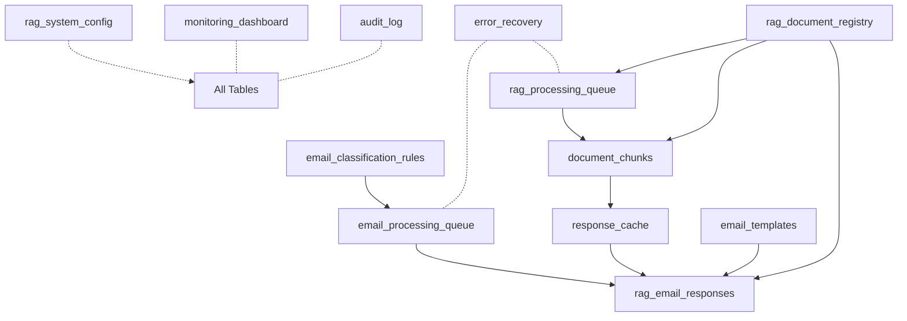

# Complete Data Tables Summary - Workato RAG Email Response System

## Core Data Tables (8 Primary Tables)

### 1. **rag_system_config**
*Purpose: Centralized configuration management for all system parameters*

```sql
CREATE TABLE rag_system_config (
    config_key VARCHAR(100) PRIMARY KEY,
    config_value TEXT NOT NULL,
    category VARCHAR(50) NOT NULL,
    description TEXT,
    updated_at TIMESTAMP NOT NULL DEFAULT CURRENT_TIMESTAMP
);
```

**Key Configuration Categories:**
- `processing`: chunk_size (1000), chunk_overlap (100)
- `ai_models`: embedding_model, gemini_model versions
- `response_gen`: confidence_threshold (0.7), max_context_docs (5)
- `cache`: cache_ttl_days (30)
- `performance`: batch_sizes, timeout values

---

### 2. **email_classification_rules**
*Purpose: Rule-based email filtering to reduce 750→150 emails without AI*

```sql
CREATE TABLE email_classification_rules (
    rule_id VARCHAR(20) PRIMARY KEY,
    rule_type VARCHAR(50) NOT NULL, -- 'sender_domain', 'subject_regex', 'body_contains'
    pattern VARCHAR(500) NOT NULL,
    action VARCHAR(50) NOT NULL, -- 'archive', 'delete', 'need_response', 'route_to_team'
    priority INTEGER NOT NULL, -- 1=highest priority
    active BOOLEAN NOT NULL DEFAULT TRUE,
    created_at TIMESTAMP NOT NULL DEFAULT CURRENT_TIMESTAMP,
    hit_count INTEGER DEFAULT 0,
    last_hit TIMESTAMP
);
```

**Rule Examples:**
- Filter out noreply@, newsletter@, notification@ senders
- Archive order confirmations, shipping notifications
- Prioritize "urgent", "critical" subjects
- Route based on department keywords

---

### 3. **email_processing_queue**
*Purpose: Track emails through the triage → classification → response pipeline*

```sql
CREATE TABLE email_processing_queue (
    queue_id VARCHAR(50) PRIMARY KEY,
    message_id VARCHAR(100) UNIQUE NOT NULL, -- Gmail message ID
    thread_id VARCHAR(100), -- Gmail thread ID
    received_at TIMESTAMP NOT NULL,
    sender VARCHAR(255) NOT NULL,
    subject TEXT,
    category VARCHAR(50), -- 'needs_ai', 'auto_archive', 'needs_response'
    status VARCHAR(30) NOT NULL, -- 'pending', 'processing', 'completed', 'failed'
    attempts INTEGER DEFAULT 0,
    processed_at TIMESTAMP,
    response_time_ms INTEGER,
    error_message TEXT,
    labels JSON -- Gmail labels array
);
```

**Daily Volume:** ~750 records/day
**Retention:** 30 days
**SLA:** Process within 15 seconds

---

### 4. **rag_processing_queue**
*Purpose: Track document processing and embedding generation jobs*

```sql
CREATE TABLE rag_processing_queue (
    job_id VARCHAR(50) PRIMARY KEY,
    job_type VARCHAR(50) NOT NULL, -- 'chunk_document', 'generate_embeddings', 'update_index'
    document_id VARCHAR(50), -- FK to rag_document_registry
    source_path VARCHAR(500),
    priority INTEGER DEFAULT 5, -- 1-10 scale
    status VARCHAR(30) NOT NULL, -- 'queued', 'processing', 'completed', 'failed', 'retry'
    attempts INTEGER DEFAULT 0,
    max_attempts INTEGER DEFAULT 3,
    created_at TIMESTAMP NOT NULL,
    started_at TIMESTAMP,
    completed_at TIMESTAMP,
    next_retry_at TIMESTAMP,
    -- Progress tracking
    total_items INTEGER,
    processed_items INTEGER DEFAULT 0,
    progress_percentage DECIMAL(5,2) DEFAULT 0,
    -- Results
    result_summary JSON,
    error_message TEXT,
    error_details JSON,
    -- Resource tracking
    tokens_consumed INTEGER DEFAULT 0,
    api_calls_made INTEGER DEFAULT 0,
    processing_time_seconds INTEGER,
    -- Metadata
    triggered_by VARCHAR(100), -- 'drive_change', 'manual', 'scheduled'
    recipe_name VARCHAR(100),
    correlation_id VARCHAR(50) -- Links related jobs
);
```

**Daily Volume:** 10-50 jobs/day
**Retention:** 7 days after completion
**Processing:** Background, minutes to hours

---

### 5. **response_cache**
*Purpose: Cache frequently asked questions to achieve >30% hit rate*

```sql
CREATE TABLE response_cache (
    cache_id VARCHAR(50) PRIMARY KEY,
    query_hash VARCHAR(64) UNIQUE NOT NULL, -- SHA256 of normalized query
    query_text TEXT NOT NULL,
    response_text TEXT NOT NULL,
    confidence DECIMAL(3,2) NOT NULL,
    use_count INTEGER DEFAULT 0,
    last_used TIMESTAMP NOT NULL,
    created_at TIMESTAMP NOT NULL,
    expires_at TIMESTAMP NOT NULL,
    source_docs JSON, -- Array of document IDs used
    avg_response_time_ms INTEGER,
    user_feedback_score DECIMAL(3,2) -- Optional user rating
);
```

**Target:** 30-50 high-frequency Q&As cached
**TTL:** 30 days (configurable)
**Benefit:** Reduce API costs by ~30%

---

### 6. **rag_document_registry**
*Purpose: Master registry of all documents in the knowledge base*

```sql
CREATE TABLE rag_document_registry (
    document_id VARCHAR(50) PRIMARY KEY,
    source_path VARCHAR(500) NOT NULL, -- Google Drive path
    storage_path VARCHAR(500) NOT NULL, -- GCS path
    file_hash VARCHAR(64) NOT NULL, -- SHA256 for change detection
    chunk_count INTEGER DEFAULT 0,
    embedding_status VARCHAR(30) NOT NULL, -- 'pending', 'processing', 'indexed', 'failed'
    last_processed TIMESTAMP,
    file_size BIGINT,
    mime_type VARCHAR(100),
    version INTEGER DEFAULT 1,
    is_active BOOLEAN DEFAULT TRUE,
    metadata JSON, -- Custom metadata
    created_at TIMESTAMP NOT NULL,
    updated_at TIMESTAMP NOT NULL
);
```

**Expected Documents:** 100-500 active documents
**Update Frequency:** Daily to weekly
**Storage:** Google Cloud Storage

---

### 7. **rag_email_responses**
*Purpose: Audit log of all AI-generated email responses*

```sql
CREATE TABLE rag_email_responses (
    response_id VARCHAR(50) PRIMARY KEY,
    email_message_id VARCHAR(100) NOT NULL, -- FK to email_processing_queue
    sender VARCHAR(255) NOT NULL,
    query TEXT NOT NULL, -- Extracted user query
    response_text TEXT, -- Generated response
    confidence DECIMAL(3,2) NOT NULL,
    response_sent BOOLEAN NOT NULL,
    tokens_used INTEGER,
    cache_hit BOOLEAN NOT NULL,
    response_time_ms INTEGER,
    model_used VARCHAR(50), -- 'gemini-pro', 'gemini-flash'
    context_documents JSON, -- Documents used for RAG
    human_reviewed BOOLEAN DEFAULT FALSE,
    created_at TIMESTAMP NOT NULL
);
```

**Daily Volume:** 50-100 responses
**Purpose:** Quality monitoring, billing, improvement

---

### 8. **monitoring_dashboard**
*Purpose: Real-time metrics and alerting*

```sql
CREATE TABLE monitoring_dashboard (
    metric_name VARCHAR(100) NOT NULL,
    metric_value DECIMAL(10,2) NOT NULL,
    timestamp TIMESTAMP NOT NULL,
    category VARCHAR(50) NOT NULL, -- 'volume', 'performance', 'efficiency', 'cost'
    alert_triggered BOOLEAN DEFAULT FALSE,
    details JSON,
    PRIMARY KEY (metric_name, timestamp)
);
```

**Key Metrics Tracked:**
- `emails_per_hour`: Volume monitoring
- `avg_response_time`: SLA tracking
- `cache_hit_rate`: Efficiency
- `daily_cost`: Budget monitoring
- `error_rate`: System health
- `queue_depth`: Backlog monitoring

---

## Additional Supporting Tables (4 Recommended Tables)

### 9. **document_chunks**
*Purpose: Store processed document chunks with embeddings*

```sql
CREATE TABLE document_chunks (
    chunk_id VARCHAR(50) PRIMARY KEY,
    document_id VARCHAR(50) NOT NULL, -- FK to rag_document_registry
    chunk_index INTEGER NOT NULL,
    chunk_text TEXT NOT NULL,
    token_count INTEGER NOT NULL,
    embedding_vector BLOB, -- Store actual vector
    embedding_model VARCHAR(50),
    created_at TIMESTAMP NOT NULL,
    UNIQUE KEY (document_id, chunk_index)
);
```

---

### 10. **email_templates**
*Purpose: Reusable response templates*

```sql
CREATE TABLE email_templates (
    template_id VARCHAR(50) PRIMARY KEY,
    template_name VARCHAR(100) NOT NULL,
    template_text TEXT NOT NULL,
    placeholders JSON, -- Required variables
    category VARCHAR(50),
    use_count INTEGER DEFAULT 0,
    active BOOLEAN DEFAULT TRUE,
    created_at TIMESTAMP NOT NULL
);
```

---

### 11. **audit_log**
*Purpose: Complete system audit trail*

```sql
CREATE TABLE audit_log (
    log_id VARCHAR(50) PRIMARY KEY,
    action_type VARCHAR(50) NOT NULL,
    entity_type VARCHAR(50) NOT NULL,
    entity_id VARCHAR(50),
    user_id VARCHAR(100),
    timestamp TIMESTAMP NOT NULL,
    details JSON,
    ip_address VARCHAR(45),
    recipe_name VARCHAR(100)
);
```

---

### 12. **error_recovery**
*Purpose: Track and manage system errors for recovery*

```sql
CREATE TABLE error_recovery (
    error_id VARCHAR(50) PRIMARY KEY,
    source_table VARCHAR(50) NOT NULL,
    source_id VARCHAR(50) NOT NULL,
    error_type VARCHAR(100) NOT NULL,
    error_message TEXT NOT NULL,
    stack_trace TEXT,
    recovery_status VARCHAR(30), -- 'pending', 'retrying', 'resolved', 'escalated'
    retry_count INTEGER DEFAULT 0,
    occurred_at TIMESTAMP NOT NULL,
    resolved_at TIMESTAMP,
    resolution_notes TEXT
);
```

---

## Table Relationships Diagram



---

## Key Implementation Notes

### Pipeline Separation
```yaml
Email Pipeline (Real-time):
  Input: 750 emails/day
  Tables: email_classification_rules → email_processing_queue → rag_email_responses
  SLA: <15 seconds
  Priority: User-facing, synchronous

Document Pipeline (Background):
  Input: Document changes from Google Drive
  Tables: rag_document_registry → rag_processing_queue → document_chunks
  SLA: Minutes to hours acceptable
  Priority: Background, asynchronous
```

### Critical Indexes
```sql
-- Email Pipeline Performance
CREATE INDEX idx_epq_status ON email_processing_queue(status, received_at);
CREATE INDEX idx_rc_hash ON response_cache(query_hash);
CREATE INDEX idx_rer_time ON rag_email_responses(created_at DESC);

-- Document Pipeline Performance  
CREATE INDEX idx_rpq_status ON rag_processing_queue(status, priority DESC, created_at);
CREATE INDEX idx_rpq_document ON rag_processing_queue(document_id);
CREATE INDEX idx_dc_document ON document_chunks(document_id, chunk_index);

-- Monitoring Performance
CREATE INDEX idx_md_metric ON monitoring_dashboard(metric_name, timestamp DESC);
```

### Data Retention Strategy

| Table | Retention | Archive Strategy |
|-------|-----------|-----------------|
| email_processing_queue | 30 days | Move to cold storage |
| rag_processing_queue | 7 days | Delete after completion |
| response_cache | 30 days | Auto-expire |
| rag_email_responses | 90 days | Aggregate & archive |
| monitoring_dashboard | 7 days detailed, 90 days aggregated | Roll up hourly |
| audit_log | 1 year | Compress & archive |
| document_chunks | While parent active | Cascade delete |

### Volume Projections (30-day)

| Table | Records | Storage |
|-------|---------|---------|
| email_processing_queue | ~22,500 | ~10 MB |
| rag_processing_queue | ~1,000 | ~2 MB |
| response_cache | ~600 active | ~5 MB |
| rag_email_responses | ~3,000 | ~15 MB |
| rag_document_registry | ~500 | ~1 MB |
| document_chunks | ~10,000 | ~50 MB |
| monitoring_dashboard | ~43,200 | ~20 MB |

### Workato Configuration

**Lookup Tables Setup:**
- **Real-time updates**: email_processing_queue, rag_email_responses
- **Cached (5 min)**: response_cache, monitoring_dashboard  
- **On-demand**: rag_system_config, email_classification_rules
- **Batch updates**: rag_processing_queue, document_chunks

**Table Connections:**
- All tables accessible via Workato's database connector
- Custom RAG_Utils connector for complex operations
- Scheduled recipes for maintenance and cleanup
