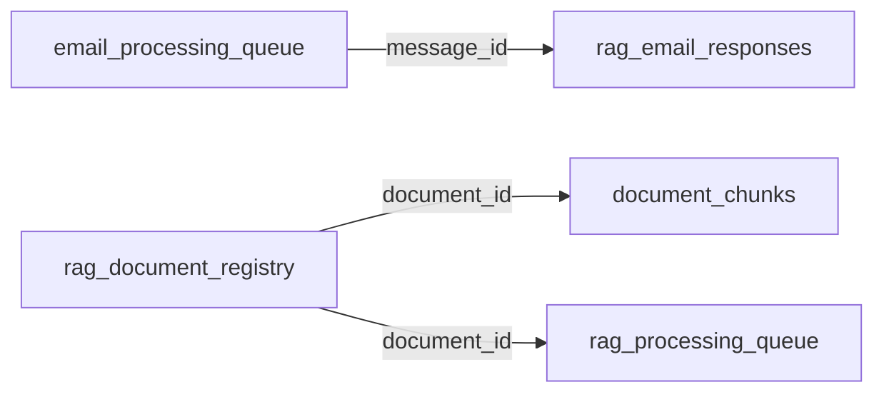

# Complete Table Relationships in RAG Email Response System

## Relationship Types Overview

```yaml
Relationship Types:
  1. Direct Foreign Keys (FK): Explicit database constraints
  2. Logical References: Application-enforced relationships
  3. JSON References: IDs stored in JSON fields
  4. Temporal Relations: Time-based connections
  5. Configuration Dependencies: Settings affecting behavior
```

---

## **PRIMARY RELATIONSHIPS MAP**

### 1. **email_processing_queue** (Central Hub)
```yaml
Acts as: Primary transaction table for email flow

OUTGOING RELATIONSHIPS:
  → rag_email_responses (1:1)
    - FK: email_processing_queue.message_id = rag_email_responses.email_message_id
    - Type: One email can have one response
    - Cascade: When email deleted, response remains (audit trail)
    
  → response_cache (M:1)
    - Logical: email_processing_queue.cache_key = response_cache.query_hash
    - Type: Many emails can use same cached response
    - Purpose: Quick response lookup
    
  → email_classification_rules (M:1)
    - Logical: email_processing_queue.classification_rule = email_classification_rules.rule_id
    - Type: Many emails can match same rule
    - Purpose: Track which rule classified the email
    
  → error_recovery (1:M)
    - Logical: email_processing_queue.queue_id = error_recovery.source_id
    - Type: One email can have multiple error records
    - Purpose: Error tracking and recovery

INCOMING RELATIONSHIPS:
  ← monitoring_dashboard (Aggregated)
    - Type: Metrics derived from queue status
    - No direct FK, aggregated via queries
    
  ← audit_log (1:M)
    - Logical: References via entity_id
    - Type: One email has multiple audit entries
```

### 2. **rag_document_registry** (Document Master)
```yaml
Acts as: Master record for all knowledge base documents

OUTGOING RELATIONSHIPS:
  → document_chunks (1:M) [STRONG FK]
    - FK: rag_document_registry.document_id = document_chunks.document_id
    - Type: One document has many chunks
    - Cascade: Delete document → delete all chunks
    
  → rag_processing_queue (1:M)
    - FK: rag_document_registry.document_id = rag_processing_queue.document_id
    - Type: One document can have multiple processing jobs
    - Purpose: Track document processing history

INCOMING RELATIONSHIPS:
  ← rag_email_responses (M:M via JSON)
    - JSON: rag_email_responses.context_documents contains [document_ids]
    - Type: Response can reference multiple documents
    - Purpose: Track which documents answered query
    
  ← response_cache (M:M via JSON)
    - JSON: response_cache.source_docs contains [document_ids]
    - Type: Cached response references multiple documents
    - Purpose: Invalidate cache when documents update
```

### 3. **rag_processing_queue** (Job Orchestrator)
```yaml
Acts as: Workflow manager for background jobs

SELF-REFERENTIAL RELATIONSHIP:
  → rag_processing_queue (1:1)
    - Field: depends_on references another job_id
    - Type: Job dependency chain
    - Example: embed_job depends_on chunk_job
    
CORRELATION RELATIONSHIP:
  → rag_processing_queue (1:M)
    - Field: correlation_id groups related jobs
    - Type: Multiple jobs for same workflow
    - Example: chunk + embed + index jobs share correlation_id

OUTGOING RELATIONSHIPS:
  → rag_document_registry (M:1)
    - FK: rag_processing_queue.document_id = rag_document_registry.document_id
    - Type: Many jobs can process same document
    - Purpose: Track what document is being processed
```

### 4. **response_cache** (Performance Optimizer)
```yaml
Acts as: Frequently asked questions cache

RELATIONSHIPS:
  → rag_document_registry (M:M via JSON)
    - JSON: source_docs contains [document_ids]
    - Purpose: Track source documents for cache invalidation
    
  ← email_processing_queue (1:M)
    - Logical: Multiple emails can hit same cache entry
    - Field: cache_key lookup
    
  ← rag_email_responses (1:1)
    - Logical: Response can indicate cache_hit = true
    - Purpose: Track cache effectiveness
```

### 5. **rag_email_responses** (Response Archive)
```yaml
Acts as: Complete record of all generated responses

RELATIONSHIPS:
  → email_processing_queue (1:1)
    - FK: rag_email_responses.email_message_id = email_processing_queue.message_id
    - Type: Each response links to one email
    - Required: Cannot have response without email
    
  → rag_document_registry (M:M via JSON)
    - JSON: context_documents contains [document_ids]
    - Type: Response uses multiple documents
    
  → response_cache (Logical)
    - Field: cache_hit indicates if cache was used
    - Purpose: Performance tracking
```

---

## **SUPPORTING TABLE RELATIONSHIPS**

### 6. **document_chunks** (Content Storage)
```yaml
RELATIONSHIPS:
  → rag_document_registry (M:1) [STRONG FK]
    - FK: document_chunks.document_id = rag_document_registry.document_id
    - Type: Many chunks belong to one document
    - Cascade: Delete document → delete chunks
    - Index: (document_id, chunk_index) for ordering
```

### 7. **email_classification_rules** (Business Logic)
```yaml
RELATIONSHIPS:
  ← email_processing_queue (1:M)
    - Referenced by: classification_rule field
    - Type: One rule classifies many emails
    - Soft reference: Rule deletion doesn't affect processed emails
```

### 8. **email_templates** (Response Formatting)
```yaml
RELATIONSHIPS:
  ← rag_email_responses (Logical)
    - Application uses template_id during response generation
    - Type: One template used for many responses
    - Soft reference: Template stored in response metadata
```

### 9. **monitoring_dashboard** (Metrics Aggregation)
```yaml
RELATIONSHIPS:
  ← ALL TABLES (Aggregation)
    - No direct FKs
    - Derives metrics from all tables via queries
    - Temporal relationship via timestamps
    - JSON details field may contain entity references
```

### 10. **audit_log** (Universal Tracker)
```yaml
RELATIONSHIPS:
  ← ALL TABLES (Polymorphic)
    - Fields: entity_type + entity_id
    - Can reference any table's records
    - Examples:
      - entity_type: "email", entity_id: message_id
      - entity_type: "document", entity_id: document_id
      - entity_type: "cache", entity_id: cache_id
```

### 11. **error_recovery** (Error Management)
```yaml
RELATIONSHIPS:
  ← ALL TABLES (Polymorphic)
    - Fields: source_table + source_id
    - Tracks errors from any table
    - Self-referential for retry chains
    - No cascade deletes (keeps error history)
```

### 12. **rag_system_config** (Global Settings)
```yaml
RELATIONSHIPS:
  → ALL TABLES (Configuration)
    - No direct FKs
    - All tables read configuration values
    - Changes affect system behavior globally
    - Categories determine which subsystem uses config
```

---

## **RELATIONSHIP PATTERNS**

### Primary Key Chains


### JSON Reference Arrays
```yaml
Example: rag_email_responses.context_documents
Value: ["doc_001", "doc_002", "doc_003"]

Query to join:
SELECT r.*, d.source_path
FROM rag_email_responses r
CROSS JOIN JSON_ARRAY_ELEMENTS_TEXT(r.context_documents::json) AS doc_id
LEFT JOIN rag_document_registry d ON d.document_id = doc_id
```

### Temporal Relationships
```yaml
Time-based joins:
- Emails processed in same hour
- Documents updated since last cache refresh
- Jobs in same correlation window
- Metrics in same time bucket
```

---

## **DATA FLOW RELATIONSHIPS**

### Email Processing Flow
```yaml
1. email_classification_rules → email_processing_queue
   - Rules determine initial classification
   
2. email_processing_queue → response_cache
   - Check for cached answer
   
3. email_processing_queue → rag_email_responses
   - Generate and store response
   
4. rag_email_responses → monitoring_dashboard
   - Update metrics
```

### Document Processing Flow
```yaml
1. rag_document_registry → rag_processing_queue
   - Create processing jobs
   
2. rag_processing_queue → document_chunks
   - Generate chunks from document
   
3. document_chunks → Vector Index (external)
   - Create searchable embeddings
   
4. response_cache ← Invalidation
   - Clear cache when documents update
```

---

## **COMPLEX RELATIONSHIP QUERIES**

### Query 1: Email with Full Context
```sql
SELECT 
    e.queue_id,
    e.sender,
    e.subject,
    r.response_text,
    r.confidence,
    c.template_text as cache_response,
    rule.pattern as classification_rule,
    array_agg(DISTINCT d.source_path) as source_documents
FROM email_processing_queue e
LEFT JOIN rag_email_responses r ON e.message_id = r.email_message_id
LEFT JOIN response_cache c ON e.cache_key = c.query_hash
LEFT JOIN email_classification_rules rule ON e.classification_rule = rule.rule_id
LEFT JOIN LATERAL (
    SELECT d.source_path
    FROM JSON_ARRAY_ELEMENTS_TEXT(r.context_documents::json) AS doc_id
    JOIN rag_document_registry d ON d.document_id = doc_id
) d ON true
WHERE e.queue_id = 'eq_20240115_001'
GROUP BY e.queue_id, e.sender, e.subject, r.response_text, r.confidence, c.template_text, rule.pattern;
```

### Query 2: Document Impact Analysis
```sql
-- Find all emails affected by a document update
SELECT 
    d.document_id,
    d.source_path,
    COUNT(DISTINCT r.response_id) as responses_using_doc,
    COUNT(DISTINCT c.cache_id) as cache_entries_using_doc,
    COUNT(DISTINCT e.sender) as unique_users_affected
FROM rag_document_registry d
LEFT JOIN rag_email_responses r 
    ON r.context_documents::jsonb @> to_jsonb(d.document_id)
LEFT JOIN response_cache c 
    ON c.source_docs::jsonb @> to_jsonb(d.document_id)
LEFT JOIN email_processing_queue e 
    ON e.message_id = r.email_message_id
WHERE d.document_id = 'doc_001'
GROUP BY d.document_id, d.source_path;
```

### Query 3: Job Dependency Tree
```sql
WITH RECURSIVE job_tree AS (
    -- Anchor: Find root job
    SELECT 
        job_id, 
        job_type, 
        depends_on,
        correlation_id,
        1 as level
    FROM rag_processing_queue
    WHERE correlation_id = 'corr_batch_001' 
        AND depends_on IS NULL
    
    UNION ALL
    
    -- Recursive: Find dependent jobs
    SELECT 
        j.job_id,
        j.job_type,
        j.depends_on,
        j.correlation_id,
        jt.level + 1
    FROM rag_processing_queue j
    INNER JOIN job_tree jt ON j.depends_on = jt.job_id
)
SELECT * FROM job_tree ORDER BY level, job_id;
```

---

## **RELATIONSHIP INTEGRITY RULES**

### Cascade Rules
```yaml
Hard Deletes (CASCADE):
  - rag_document_registry → document_chunks
  - email_processing_queue → email_attachments (if implemented)

Soft Deletes (RETAIN):
  - email_processing_queue → rag_email_responses (audit trail)
  - email_classification_rules → email_processing_queue (historical record)
  - rag_document_registry → response_cache (mark invalid, don't delete)

No Delete (RESTRICT):
  - Active processing jobs
  - Emails with pending responses
  - Documents currently being indexed
```

### Referential Integrity Checks
```sql
-- Check orphaned chunks
SELECT COUNT(*) as orphaned_chunks
FROM document_chunks c
LEFT JOIN rag_document_registry d ON c.document_id = d.document_id
WHERE d.document_id IS NULL;

-- Check invalid cache references
SELECT COUNT(*) as invalid_cache_docs
FROM response_cache c
CROSS JOIN JSON_ARRAY_ELEMENTS_TEXT(c.source_docs::json) AS doc_id
LEFT JOIN rag_document_registry d ON d.document_id = doc_id
WHERE d.document_id IS NULL;

-- Check broken job dependencies
SELECT COUNT(*) as broken_dependencies
FROM rag_processing_queue j1
LEFT JOIN rag_processing_queue j2 ON j1.depends_on = j2.job_id
WHERE j1.depends_on IS NOT NULL AND j2.job_id IS NULL;
```

## **Key Relationship Characteristics**

1. **Hub Tables**: `email_processing_queue` and `rag_document_registry` are central
2. **Polymorphic Relations**: `audit_log` and `error_recovery` can reference any table
3. **JSON Flexibility**: Many-to-many relationships via JSON arrays
4. **Temporal Coupling**: Tables linked by time windows rather than FKs
5. **Soft References**: Most relationships are logical, not FK-enforced
6. **Event Sourcing**: Audit trail maintains full history without hard dependencies

This relationship structure provides flexibility while maintaining data integrity through application logic rather than strict database constraints.
